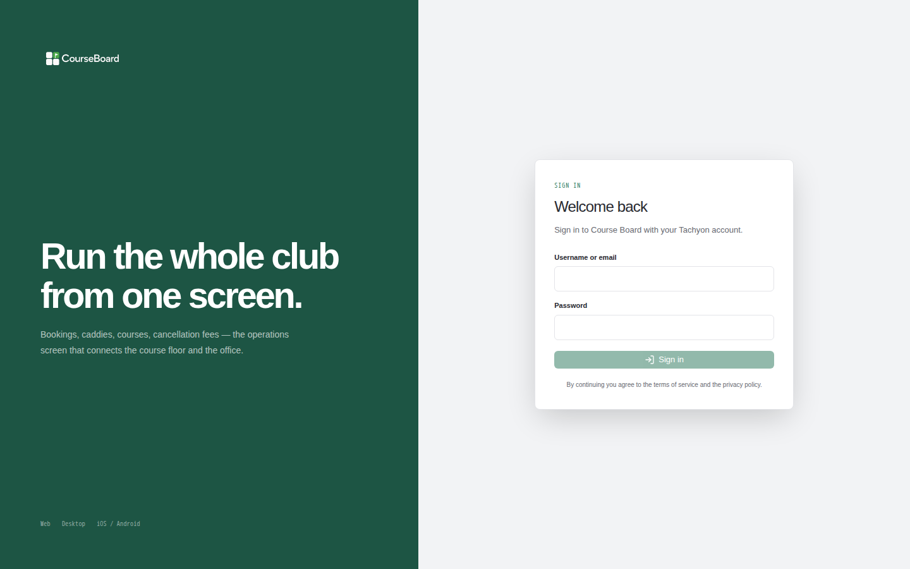
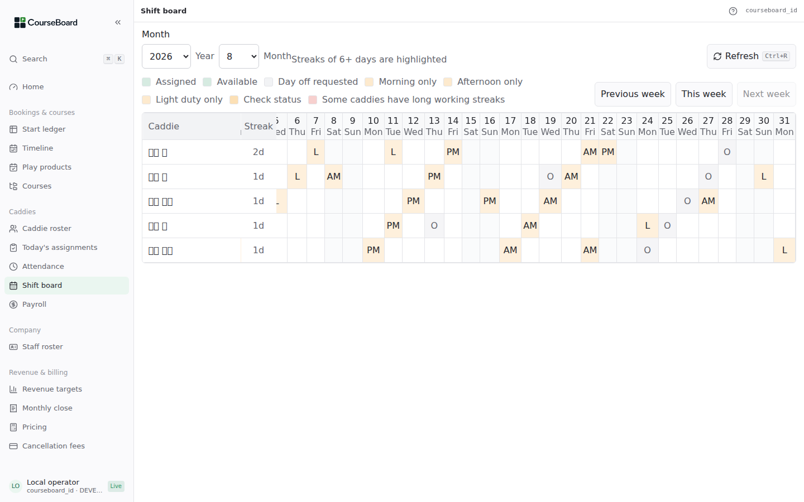
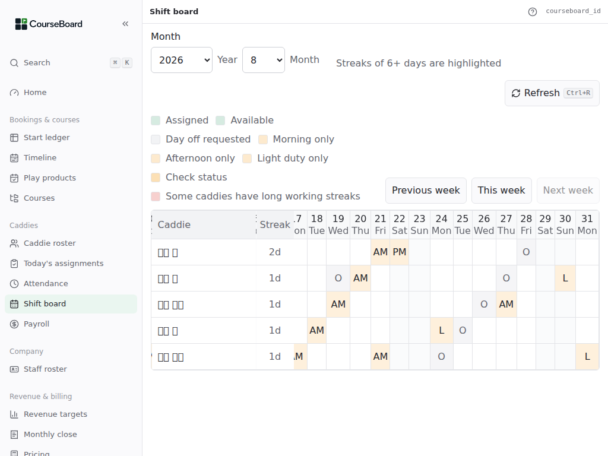
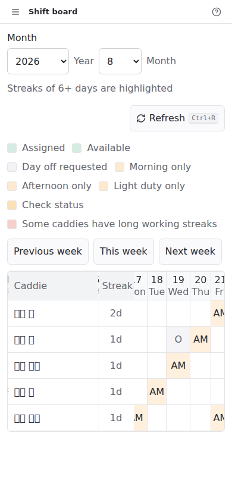

# PLT-3258 CourseBoard UI ルール

> 状態: **2026-08-09 承認済み**。確定したルールは `desktop/DESIGN.md` に統合し、
> 今回は PLT-3281 / PLT-3279 へ適用する。

## 判断の軸

CourseBoard の主な利用者は、ゴルフ場で日々のキャディ業務を管理するキャディマスタである。
キーボードショートカット、ドラッグ、隠れたメニューなど、IT 製品でよく使われる操作を
知っている前提にしない。

設計の優先順位は次の順とする。

1. 間違いを起こしにくく、起きても自分で元に戻せる
2. 読める、押せる、次にすることが分かる
3. 操作を覚えなくても、その場の表示だけで完了できる
4. 情報を狭い範囲へ多く詰め込む

表示密度を上げるために、文字、押せる範囲、説明、確認を小さくしない。

## ルール案

### 1. 仕事で普段使う言葉で書く

- 画面に内部実装名、IT 用語、略語をそのまま出さない。
- ゴルフ場で日常的に使う「キャディ」「ラウンド」「スタート」「OUT / IN」などの
  ゴルフ用語は使ってよい。利用者の仕事の言葉と、開発者だけが使う言葉を分ける。
- 初めて出す略語には日本語の説明を付ける。その後も、ボタンは日本語だけで意味が通る
  文言を優先する。
- `ja-plain` だけを平易にして終わりにしない。既定の `ja` も、操作に必要な言葉は
  平易にする。

| 避ける表示 | 使う表示の例 |
|---|---|
| インポート | 予約表をとりこむ / 表のファイルをとりこむ |
| CSV | 表のファイル（CSV）（初出） / 表のファイル |
| タイムライン | 今日の予定表 |
| 月次精算 | 1か月のしめ |
| ステータス | 今の状態 |
| コマンドパレット | 画面をさがす |
| リロード | もう一度読み込む |

「トースト」「API」「Field」「テナント」などは実装・運用文書だけの言葉とし、利用者向けの
表示には使わない。

### 2. 1画面を1つの仕事に絞る

- 1画面の主要な目的は1つにする。一覧、編集、確認を同時に詰め込まず、必要なら Sheet
  または別画面へ分ける。
- 画面を開いた時点で、次に押す主要ボタンが1つ分かる状態にする。
- 主要な仕事は、画面へ入ってから3回以内のボタン操作で開始または完了できるようにする。
  文字や数値の入力そのものは回数に含めないが、入力欄を開く、次画面へ移る、確認を進める
  操作は数える。
- キーボードショートカット、右クリック、ホバー、ドラッグだけでしか実行できない操作を
  作らない。それらは画面上のボタンに加える補助に限る。

### 3. 選べるものは入力させない

- コース、キャディ、日付、状態など候補が決まっている値は、選択肢から選ぶ。
- 自由入力は、氏名、メモ、金額など、候補をあらかじめ決められない値だけにする。
- 日付と月は共通 picker を使い、不正な文字列を利用者に直させない。
- 選択肢が多い場合は、検索できる選択欄にする。管理用 ID の転記を求めない。

### 4. 「もどす」を画面に出す

- 編集中の変更には、対象の近くへ文字付きの「元にもどす」ボタンを出す。
- `Ctrl+Z` / `⌘Z` は追加してよいが、唯一の戻し方にしない。
- 保存していない変更がある状態で画面を離れるときは、何が消えるかを日本語で確認する。
- 状態の更新に失敗した場合は、入力を消さず、その場からもう一度実行できるようにする。

### 5. 消す操作は、確認でき、あとから戻せるようにする

- 「削除」「外す」「登録を消す」を実行する前に、対象名と影響を文章で確認する。
- 「あとから戻せる」は、次のいずれかを満たすこととする。
  - 画面上の「元にもどす」で復元できる。
  - 「使用を止めたもの」などから再開できる。
  - 同じ入力で同じものを作り直せ、業務履歴、請求、参照関係などが失われない。
- 手動で作った予約枠のように、同じ時刻・同じ内容で作り直せるものは、確認後の物理削除を
  認める。物理削除かどうかではなく、利用者から見て取り返しがつくかで判断する。
- 作り直しても履歴や他データとの関係が戻らないものは、物理削除より「使用を止める」
  「一覧から隠す」を優先する。
- 「元にもどす」を提供する場合は、数秒で消える通知の中だけに置かない。
- Field の汎用的な復元機能が必要な場合は、ゴルフの文脈を外した issue を Field 側に立てる。

### 6. 文字は 16 CSS px を下限にする

- 利用者が仕事のために読む文字は、本文、表、ボタン、入力欄、補足、エラー、凡例を含め、
  **16 CSS px 未満にしない**。見出しはこれより大きくする。
- 装飾だけの文字、ロゴ内の文字、スクリーンリーダー専用文字は対象外とする。
- 小さくしないと収まらない情報は、文字を縮めず、折り返す、列を省く、別画面へ分ける、
  表の中だけをスクロールさせる方法で解く。
- 文章の行間は原則 1.5 以上にする。200% 表示でも文字や操作が欠けないことを確認する。

根拠: デジタル庁デザインシステムは、本文と UI の基準を 16 CSS px 以上としている。
CourseBoard は読み慣れや精密なポインター操作を前提にできない利用者を対象とするため、
ブラウザの既定に近いこの値を全 UI の下限とする。

- [デジタル庁デザインシステム: タイポグラフィ](https://design.digital.go.jp/dads/foundations/typography/)
- [WCAG 2.2: Resize Text](https://www.w3.org/TR/WCAG22/#resize-text)

### 7. 押せる範囲は 44 × 44 CSS px を下限にする

- ボタン、リンク、チェック欄、選択欄、押すと状態が変わる表セルは、見た目ではなく実際に
  反応する範囲を **44 × 44 CSS px 以上**にする。
- 重要な操作を文中リンクだけにしない。文字付きのボタンを同じ画面に用意する。
- 小さいアイコンを使う場合も、周囲を含む反応範囲を 44 × 44 CSS px にする。隣の反応範囲と
  重ねない。
- 44 px では横に収まらない場合も、押せる範囲を縮めない。表の中だけの横スクロール、
  固定した行・列見出し、文字付きの移動ボタンで解く。

WCAG 2.2 の AA 最低要件は 24 × 24 CSS px だが、44 × 44 CSS px はより操作しやすい
拡張基準であり、Apple も指やポインターで選びやすいボタン領域として 44 × 44 pt を
案内している。CourseBoard では、操作に不慣れな利用者とタッチ端末を含むため 44 を採る。

- [WCAG 2.2: Target Size (Minimum)](https://www.w3.org/WAI/WCAG22/Understanding/target-size-minimum)
- [WCAG 2.2: Target Size (Enhanced)](https://www.w3.org/WAI/WCAG22/Understanding/target-size-enhanced)
- [Apple Human Interface Guidelines: Buttons](https://developer.apple.com/design/human-interface-guidelines/buttons)

### 8. 月間表は、縮小やズーム機能ではなく、表の中だけを移動する

31日を持つ月間表には次を適用する。

- 表全体を1つの横スクロール領域に置く。ページ全体は横スクロールさせない。
- 氏名などの行見出しと日付見出しを固定し、どの人・どの日を見ているかを失わないようにする。
- 表の上へ 44 × 44 px 以上の「前の週」「次の週」「今週」ボタンを置く。横スクロールの
  操作を知らなくても、7日ずつ目的の日へ移動できるようにする。
- 週ごとに別画面へ分けない。連続出勤など月をまたいだ並びを見つける目的を保つ。
- 独自の縮小・拡大機能は付けない。文字の下限を崩す選択肢を増やさず、ブラウザや OS の
  拡大機能を妨げない。

データ表は二次元の関係自体に意味があるため、WCAG も表の内部スクロールを認めている。
ただし、表以外のボタンや説明は画面幅に収める。

- [WCAG: Reflow の表・グリッドの扱い](https://www.w3.org/WAI/WCAG21/Understanding/reflow)

### 9. 通知は次の操作を隠さず、押せなくしない

- 保存結果などの一時的な通知は、次に押すボタンと重ならない位置へ出す。
- 画面ごとに重なりがないと保証できない overlay は、通知自体に操作を持たせず、背後へ
  ポインター操作を通す。
- 一定時間で消すことは補助であり、重なり対策には数えない。
- 利用者が対応する必要のある失敗は、失敗した操作の近くにも表示し、通知が消えても
  内容と「もう一度試す」を確認できるようにする。
- 通知の追加で本文や選択中の行を動かさない。

### 10. 例外は理由、代替策、終了条件を記録する

基準に合わない実装が必要な場合は、黙って小さくしたり省略したりせず、次を taskdoc または
`desktop/DESIGN.md` の例外一覧へ記録する。

1. 対象画面と部品
2. 外れるルールと値
3. ルールどおりでは失われる業務上の意味または機能
4. 利用者への危険と、それを減らす代替策
5. 例外を見直す条件

「狭い方が見た目が整う」「一度に多く表示したい」だけでは例外にしない。情報の関係や業務の
目的が失われる場合に限る。部品の役割が変わった時点で例外は失効し、再判断する。

#### 例外 1: シフト表の読み取り専用日付セル

| 項目 | 内容 |
|---|---|
| 対象 | シフト表の日付セルの幅 |
| 外れる基準 | 44 px ではなく 32 px |
| 理由 | セルは操作部品ではなく、31日の連続性を読むためのデータセル。44 px にすると月間の関係を把握しにくくなる |
| 代替策 | 文字16 px、行高44 px、固定見出し、表内横スクロール、週移動ボタンを必須にする |
| 見直し条件 | セルを押して編集・選択する機能を追加した時点で失効し、44 × 44 px 以上にする |

## PLT-3281 への適用

実装を確認したところ、現在の月間セルは押して編集する部品ではなく、予定を読むための
`td` である。複数割当の説明だけが tooltip になっている。

したがって、44 px の最小幅を日付セルへ機械的に適用せず、次の値を採用した。

| 部分 | 変更前 | 適用値 |
|---|---:|---:|
| 表の文字 | 12 px | 16 px 以上 |
| 曜日 | 9 px | 16 px |
| 状態・凡例 | 10〜11 px | 16 px |
| 行の高さ | 30 px | 44 px 以上 |
| 読み取り専用の日付列 | 26 px | 32 px 以上 |
| 日付ヘッダー | 実測 38.5 px | 48 px 以上 |

日付列の 32 px は押せる範囲ではなく、1〜2桁の日付と1文字の状態を読むためのデータ列の幅で
ある。セルを編集可能に変える場合は、この例外を使わず 44 × 44 px 以上にする。

あわせて次を行う。

- 氏名列と「連続」列、日付ヘッダーを固定する。
- 「前の週」「次の週」「今週」で表を7日分ずつ移動できるようにする。
- 複数割当数を tooltip だけに置かず、セル内に表示し、読み上げ名でも確認できるようにする。
- 横スクロール可能であることを、ボタンと端の表示で分かるようにする。

この形なら、月の連続性を残しながら、文字と行を小さくして31日を無理に押し込む必要がない。

## 既存画面の違反・要確認箇所

これはソースコードで分かった範囲の一次棚卸しであり、全画面の完了監査ではない。

| 優先 | 箇所 | 現在分かっていること | 対応先 |
|---|---|---|---|
| 高 | 全画面の文字 | `body` は 13 px。`styles.css` だけでも 9〜15 px の指定が136件あり、Tailwind の `text-xs` 等は別に残る | PLT-3258 後続の横断改修 |
| 高 | 全画面の操作部品 | `--control-height` は通常28 px、狭い画面でも40 px。44 px ルールに届かない | デザインシステム密度の横断改修 |
| 高 | シフト表 | 文字9〜12 px、セル26 × 30 px。横スクロール領域と氏名列固定は既にあるが、明示的な移動ボタンと固定日付見出しはない | PLT-3281 |
| 高 | 保存結果の通知 | `AppShell` の通知は右下固定。依存部品は非常に高い重なり順で、通知が背後の操作を受ける | PLT-3279 |
| 高 | キャディの休み希望 | 「登録を消す」は確認なしで即時 DELETE し、あとから戻す入口がない | 別 issue |
| 高 | コース削除 | 対象名の確認はあるが、DELETE 後の「元にもどす」がない | 別 issue / Field capability 確認 |
| 高 | メンバー削除 | 対象名の確認はあるが、DELETE 後の「元にもどす」がない | 別 issue / Field capability 確認 |
| 中 | 既定の日本語 | 「タイムライン」「月次精算」「CSV」「コマンドパレット」「ロール」などが `ja` に残る | 文言棚卸し |
| 中 | tooltip のみの情報 | シフト表の複数割当数は hover の tooltip に依存し、キーボード・タッチで見つけにくい | PLT-3281 |
| 適合例 | コース受付時間 | 保存前の削除件数、確認、画面上の「元に戻す」がある | 維持する |
| 適合例 | 月の入力 | 共通 `YearMonthPicker` で不正な自由入力を描画へ渡さない | 維持する |

## 適用計画

136件を一度に直して既存画面を壊さないため、変更する画面から適用し、共通部品、毎日使う画面、
低頻度画面の順に残りを解消する。

### 今回直す範囲

- **PLT-3281 シフト表**: 表内の9〜12 px文字、26 × 30 pxセル、日付見出し、凡例、
  週移動操作を新ルールへ合わせる。
- **PLT-3279 通知**: 右下で次の操作を覆う通知を、表示中も操作を妨げない形へ変える。
- 上記で新しく追加または変更する操作部品は44 × 44 px以上にする。

### 今回直さない範囲

- `styles.css` に残るその他の9〜15 px指定と `text-xs` / `text-sm`
- 全画面が使う28 pxの既存コントロール密度
- 戻せない削除、既定日本語の専門用語、tooltipだけにある情報のうち、上記2画面以外

これらは今回の値を全体へ一括置換しない。一括変更は表の崩れ、文字切れ、操作の押し出しを
起こすため、次の順で別 issue に分ける。

1. **共通部品**: `body`、Button、Input、Select、Sheet、Dialog、ナビゲーションの基準値を変更し、
   主要な画面で回帰確認する。
2. **毎日使う画面**: 今日の予定表、予約台帳、今日の配置、出勤、キャディ名簿を業務単位で直す。
3. **月次・設定画面**: 給与、売上目標、1か月のしめ、コース・予約設定などを直す。
4. 各 issue の開始時に残件を再集計し、taskdoc に「直した箇所・残した箇所・例外」を記録する。

移行中も、新規画面と、別の目的で触った既存部品には新ルールを適用する。守れない場合は
上記の例外手順を使う。「既存も違反している」は新しい違反を増やす理由にしない。

## 確認方法

実装後に、少なくとも次を確認する。

1. 31日の月を表示し、1440 × 900、1024 × 768、タッチ相当の狭い幅で表を確認する。
2. 仕事に必要な文字の computed font-size が 16 px 以上であることを確認する。
3. すべての操作部品の反応範囲が 44 × 44 px 以上であることを確認する。
4. 200% 表示で情報や操作が欠けないことを確認する。
5. 「前の週」「次の週」「今週」だけで表を移動でき、氏名と日付を見失わないことを確認する。
6. 保存通知が出ている間も、保存、今日の配置、キャディ決定などの次の操作を押せることを確認する。
7. `ja` / `ja-plain` / `en` の3表示で文字切れと意味を確認する。

## 今回の実機確認の範囲

2026-08-09 に tachyon-browser で `https://courseboard.txcloud.app` を開いたが、ログイン画面
までで、対象テナントのシフト表と通知再現画面には入れなかった。認証情報の取得や本番データへの
別経路は探していない。

tachyon-browser の遠隔 Chromium からローカル Vite へは接続できなかったため、本番とは別に
ローカル Chromium でモックデータを表示して確認した。31日のある2026年8月を使い、次を確認した。

- 1440 × 900、1024 × 768、390 × 844 で、ページ全体ではなく表の中だけが横に動く。
- 本文・日付・曜日・状態・凡例は computed font-size 16 px、行は44 px、日付見出しは48 px。
- 月選択と週移動ボタンの反応範囲は44 px以上。日付列だけ、記録した例外により32 px。
- 「前の週」「次の週」で端まで到達し、端ではボタンが無効になる。「今週」は対象月へ戻し、
  今日の日付を表示範囲へ入れる。
- 横に動かした後も氏名列と連勤列が固定される。日付見出しも表内の縦移動に備えて固定した。
- 1024 px の200%表示に相当する CSS viewport 512 px でもページ全体の横はみ出しがなく、
  表の移動と44 pxの操作部品を維持する。
- 通知は上中央、文字16 pxで表示され、通知とそのコンテナの `pointer-events` は `none`。
  通知の中央で hit test しても背後の画面要素が対象となり、成功通知は4秒後に消える。

ローカル Chromium には日本語グリフを持つフォントがなく、画像内の日本語氏名は四角で表示された。
DOM の読み上げ名と翻訳の自動テストでは日本語を確認したが、日本語フォントでの視覚確認と本番データでの
最終確認は、対象テナントへログインできるようになった時点で行う。

